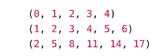
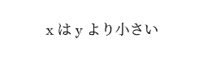
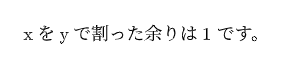
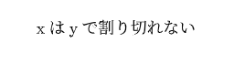
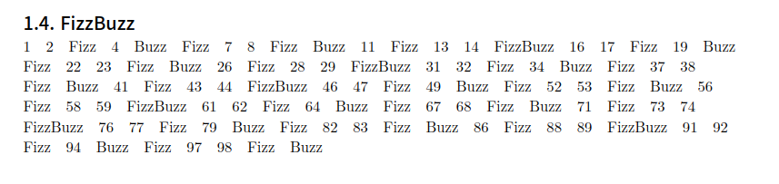

# 【クソ記事】TypstでFizzBuzzを書く

## はじめに
おひさしぶりです、ごまです。
この記事ではRust製の組版システムである**Typst**を使って**FizzBuzz**を実装してみます。
Typstって？という方は以前私が書いた[こちらの記事](https://oucrc.net/articles/ceqdf3jgz7z)を読んでいただけると概略がつかめるかもしれません。

## FizzBuzzとは
FizzBuzzとは、プログラミングの基礎的な練習問題の1つで、次のようなルールに従って数列を出力する課題です。


【ルール】
1から順に整数を出力していくが、

- 3の倍数のときは数の代わりに "Fi zz" を出力

- 5の倍数のときは数の代わりに "Buzz" を出力

- 3と5の両方の倍数（=15の倍数）のときは "FizzBuzz" を出力

- それ以外の数はそのまま出力

今回はこのような挙動をTypstで実装してみます。

## 環境
今回は`typst 0.13.1`を使用します。

## 使用する機能
今回主に使用するTypstの機能は
- `for`文
- 条件分岐
- `calc`モジュール

です。

### for文
Typstでは`for`文を用いて配列や文字などを反復処理することができます。

```typst
#for i in (1, 2, 3, 4, 5) {
  [#i ]
}
```

このようにfor文を使用すると次のように表示されます。見やすさのために若干スペースを空けています。


数字で構成される配列を準備するには、次のような`range`関数を使用することもできます。

```typst
#range(5)\
#range(1, 7)\
#range(2, step: 3, 20)
```
このようにすると、次のように表示されます。

`range`関数は、指定した範囲の整数を生成するための便利な関数です。ほとんどPythonなどと同じような使い方ができるので、特に難しいことはないと思います。

### 条件分岐
Typstでは`if`文を用いて条件分岐を行うことができます。

```typst
#let x = 3
#let y = 5
#if x == y {
  "xとyは等しい"
} else if x < y {
  "xはyより小さい"
} else {
  "xはyより大きい"
}
```

このようにすると、次のように表示されます。


こちらもクセのない記法なのでかなり書きやすい印象です。

### calcモジュール
Typstでは`calc`モジュールを用いて数値の計算と処理を行うことができます。
絶対値や平方根などはもちろん、逆三角関数のような関数の計算までできるようですが、ここでは除算における余りを求める`rem`関数を使用します。`rem(x,y)`の形で使用すると、`x`を`y`で割った余り(符号は`x`に従う)を返します。
```typst
#let x = 10
#let y = 3
#let z = calc.rem(x, y)

xをyで割った余りは#z です。
```
このようにすると、次のように表示されます。


これとif文を組み合わせると`x`が`y`で割り切れるかどうかを判定することができます。
```typst
#let x = 10
#let y = 3
#if calc.rem(x, y) == 0 {
  "xはyで割り切れる"
} else {
  "xはyで割り切れない"
}
```
このようにすると、次のように表示されます。


これらの機能を組み合わせてFizzBuzzを実装していきます。

## FizzBuzzの実装
```typst
#for i in range(1, 101) {
  if ((calc.rem(i, 3) == 0) and (calc.rem(i, 5) == 0 )){
    [FizzBuzz#h(1em)]
  } else if calc.rem(i, 3) == 0 {
    [Fizz#h(1em)]
  } else if calc.rem(i, 5) == 0 {
    [Buzz#h(1em)]  
  } else {
    [#i#h(1em)]
  }
}
```

このようにすると、次のように表示されます。



これだけです。簡単ですね。

## おわりに
組版システムでFizzBuzzを実装するということでもっと時間がかかるかと思いきや、Typst側の機能が強力だったためほとんど一瞬で終わってしまいました...。何か誤りなどがあれば教えていただけると幸いです。
また、今回作成したコードはGitHubの[リポジトリ](https://github.com/gomazarashi/typst_fizzbuzz)に置いてあるので、興味のある方はぜひご覧ください。

